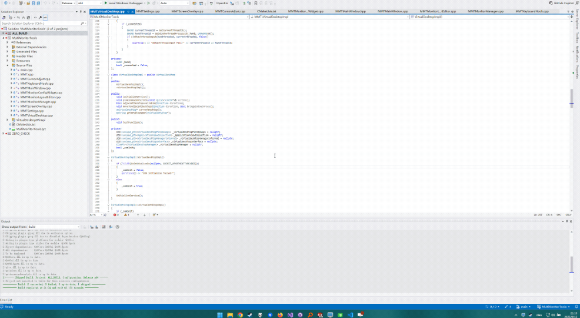

# MultiMonitorTools
A utility app for Windows 11 that enhances the multi-monitor experience.

# Features

- Enable or disable virtual desktops separately for each monitor:
<p align="center">

</p>

- Replaces the default windows virtual desktop switching animation to a customizable switching animation:
<p align="center">

</p>

- When the mouse cursor crosses monitors, adjust its position to be physically accurate.

- Send windows to other monitors or virtual desktops with customizable hotkeys.

- Customize the tray icon for each virtual desktop to check the current virtual desktop at a glance.

# Using the app
If you haven't already, install the [Visual C++ Redistributable Packages](https://aka.ms/vs/17/release/VC_redist.x64.exe).

- Enabling/Disabling virtual desktops for a monitor:

  Select the respective monitor in `Monitor Settings` and toggle `Enable virtual desktops`.

- Setting up physically accurate cursor position when crossing monitors:

  * In windows display settings, set up the display layout to match your monitor layout, and enable `Ease cursor movement between displays`. Windows controls when the mouse cursor crosses to a different monitor, and `MultiMonitorTools` detects this transition and adjusts the cursor's location to be physically accurate.

  * In `MultiMonitorTools`, drag and drop the monitor layout to match your physical monitor layout. The default physical sizes are read from the monitors' `EDID` data, but this might not be accurate, so adjust their sizes if necessary.

  * To fine tune the monitors' geometry, toggle `Draw grid lines` to draw a grid of lines on the monitors. Fine tune your monitor layout until the grid lines align across monitors. The cursor's position will follow these grid lines.

- Customize hotkeys with the hotkey editor to:
  * Switch to another virtual desktop
  * Send a window to another virtual desktop
  * Send a window to another monitor
  * display a temporary prompt that shows the current desktop name
  * Check out the default hotkeys

# Building

### Required tools:
- MSVC2022 v143 build tools
- Windows 11 SDK

The above can be installed from Visual Studio's installer

- CMake (version >= 3.21)

### Build instructions
- Clone the repository:
```
git clone https://github.com/ChonkyBuilds/MultiMonitorTools.git
```

- Setup the project with CMake:

Launch a terminal at the root location, where `CMakeLists.txt` is, and run the following:
```
cmake -S . -B build -G "Visual Studio 17 2022" -A x64 -T v143
```

Setup takes a while since Qt6 has to be downloaded. If you already have Qt6(version >= 6.8) on your system, you can use that by setting the `Qt6_DIR` variable to where `Qt6Config.cmake` is:
```
cmake -S . -B build -G "Visual Studio 17 2022" -A x64 -T v143 -DQt6_DIR="YourQt6Location/6.9.1/msvc2022_64/lib/cmake/Qt6"
```

- Build the project:
    - Run the following:
    ```
    cmake --build build --config Release
    ```

    - Or open the `.sln` generated in the `build` folder and build with Visual Studio.

# License

This software is licensed under **GPLv3**.

# Credits
Some code are taken/adapted from the following projects:

- [https://github.com/MScholtes/VirtualDesktop](https://github.com/MScholtes/VirtualDesktop)
- [https://github.com/Ciantic/VirtualDesktopAccessor](https://github.com/Ciantic/VirtualDesktopAccessor)
- [https://github.com/GKO95/Win32.EDID](https://github.com/GKO95/Win32.EDID)

This application uses Qt6 under the GPL license. [Qt source](https://www.qt.io/download-open-source).